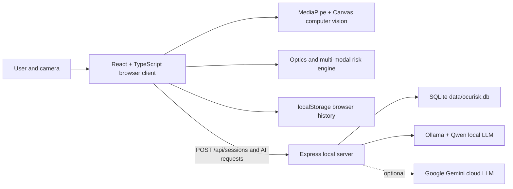

# OcuRisk AI — Technical & Clinical Specification Document

**Version:** 3.0
**Document Status:** Research & Educational Screening Prototype Specification
**Last Revised:** August 2026

---

> **WHAT OCRURISK IS — AND IS NOT**
>
> **OcuRisk AI is a screening and referral-support tool.** It turns a smartphone, a browser, and under a minute of a user's time into an early-warning, multi-modal eye-health assessment: refractive-error indicators, accommodative / fixation behavior, leukocoria screening, and an explainable myopia-progression risk score — followed by a plain-language AI health note and a conversational assistant.
>
> It is built to **triage and educate**, and to direct people toward a professional examination they might otherwise skip. It is **not** a medical device, it is **not** FDA-cleared or CE-marked, and its outputs are **screening indicators, not diagnoses**. They must not be used to prescribe lenses, initiate or alter treatment, or replace examination by a licensed optometrist or ophthalmologist. All refractive estimates require clinical validation against cycloplegic autorefraction before any medical use.
>
> We state these limits up front, deliberately, because honest scoping is part of doing a health-adjacent project responsibly — and because every output the system produces carries a confidence flag for exactly the same reason.

---

## Table of Contents

1. [Executive Summary](#1-executive-summary)
2. [What's New in v3.0](#2-whats-new-in-v30)
3. [Problem Statement & Clinical Motivation](#3-problem-statement--clinical-motivation)
4. [System Overview](#4-system-overview)
5. [System Architecture](#5-system-architecture)
6. [Technology Stack](#6-technology-stack)
7. [Offline & Resilience Strategy](#7-offline--resilience-strategy)
8. [Detailed Module Specification (Steps 1–6)](#8-detailed-module-specification-steps-16)
9. [Computer Vision Pipeline (3-Tier)](#9-computer-vision-pipeline-3-tier)
10. [Optics & Signal-Processing Engine](#10-optics--signal-processing-engine)
11. [Multi-Modal Bayesian Risk Fusion](#11-multi-modal-bayesian-risk-fusion)
12. [Backend & LLM Integration (Gemini ⇄ Ollama)](#12-backend--llm-integration-gemini--ollama)
13. [Result Provenance & Confidence Model](#13-result-provenance--confidence-model)
14. [Data Model & State Management](#14-data-model--state-management)
15. [API Specification](#15-api-specification)
16. [Security, Privacy & Data Governance](#16-security-privacy--data-governance)
17. [Mathematical Foundations & References](#17-mathematical-foundations--references)
18. [Limitations, Assumptions & Validation Status](#18-limitations-assumptions--validation-status)
19. [Future Roadmap](#19-future-roadmap)
20. [Glossary](#20-glossary)
21. [References](#21-references)
22. [Appendix A — Installation & Operation](#appendix-a--installation--operation)
23. [Appendix B — Configuring the Local LLM (Ollama)](#appendix-b--configuring-the-local-llm-ollama)

---

## 1. Executive Summary

OcuRisk AI is a browser-based, smartphone-oriented, **multi-modal eye-health screening platform**. It fuses consumer-camera computer vision, an optical photorefraction engine, behavioral and genetic questionnaire inputs, and a transparent Bayesian fusion engine to produce:

- a **myopia progression risk** estimate,
- **per-eye refractive indicators** (OD/OS), and
- **leukocoria screening** —

supplemented by an AI-generated plain-language health report and a conversational assistant.

### 1.1 Three guiding principles

1. **Multi-modal evidence fusion** — no single signal is trusted in isolation. A questionnaire-derived prior is updated by optical, accommodative, and fixational evidence using a transparent, inspectable scoring scheme.
2. **Honest measurement provenance** — every output carries a confidence indicator, and the system explicitly refuses to fabricate values it cannot measure (e.g., accommodative lag, NPC). Every number is labelled with *where it came from*.
3. **Consumer-hardware accessibility with offline resilience** — the only capture device required is a standard smartphone camera, and the pipeline keeps working through flaky or absent connectivity via a graceful degradation strategy.

### 1.2 How it runs

The platform is a React single-page application (SPA) with a local Express backend. All mathematics and computer vision execute client-side. Express serves the frontend, mirrors completed sessions into local SQLite, exposes health/session APIs, and proxies the LLM so API keys never reach the browser. The LLM provider is **pluggable**: Google Gemini online, **or a fully local Ollama model** for zero-data-egress operation.

---

## 2. What's New in v3.0

v3.0 advances the prototype from "online-only research demo" toward "deployable, offline-capable screening tool" while preserving the honest-scoping discipline of earlier versions.

| Area | Change | Why it matters |
|------|--------|----------------|
| **AI provider** | Pluggable LLM abstraction in `server.ts`: switch Gemini ⇄ **local Ollama-compatible** via `LLM_PROVIDER`. | Eliminates external data egress when local; keeps the same prompt/validation flow. |
| **CV pipeline** | **3-tier resilience**: online MediaPipe → **local pre-downloaded MediaPipe** → hand-written CV. | Screening still works on a plane, a clinic with locked-down Wi-Fi, or anywhere the CDN is blocked. |
| **Offline persistence** | Completed sessions are mirrored from browser `localStorage` through Express into `data/ocurisk.db` using SQLite. | Results remain inspectable on the host computer without a remote database or cloud service. |
| **Showcase demo** | One-click "Load Demo" injects realistic pre-computed sample data and jumps to the dashboard. | Judges and reviewers can explore the full result surface in seconds, no camera needed. |
| **Result provenance** | Every output surfaces its **source** (measured / self-reported / defaulted / illustrative) and confidence flag. | Makes the "honest about what it can and can't measure" principle visible in the UI itself. |
| **Disclaimer framing** | Reframed from apologetic to capability-first while keeping full disclosure. | Communicates scope as professional transparency, not an excuse. |

> **Note on the code you are reading:** the submitted codebase reflects the v3.0 architecture described in this document. Earlier 2.x documentation described an online-only CV pipeline and a Gemini-only backend; both have been superseded.

---

## 3. Problem Statement & Clinical Motivation

### 3.1 The Global Myopia Epidemic

Myopia (nearsightedness) prevalence has risen sharply worldwide. Current projections estimate that nearly **50% of the global population will be myopic by 2050**, with ~10% having high myopia (≤ −6.00 D), which carries elevated risk of retinal detachment, glaucoma, macular degeneration, and other sight-threatening complications (Holden et al., 2016).

### 3.2 The Screening Gap

Early myopia and its progression drivers — accommodative dysfunction, convergence insufficiency, amblyogenic risk factors — are frequently asymptomatic in children. Access to cycloplegic refraction and comprehensive eye exams is limited in low-resource settings. Smartphone-based screening offers a scalable **triage layer**: identify individuals who warrant referral, rather than replacing the clinical exam.

### 3.3 Why Offline Matters

The populations with the least access to optometric care frequently also have **unreliable or metered internet**. A screening tool that hard-requires a CDN download at every launch is unusable precisely where it is most needed. v3.0's offline resilience is therefore a clinical-access feature, not an engineering nicety.

### 3.4 Design Goals

| Goal | Implementation |
|------|----------------|
| Accessible | Runs in a browser; phone camera only |
| Works offline | 3-tier CV fallback; local LLM option |
| Multi-modal | Genetics, lifestyle, optical, accommodative, fixational signals |
| Explainable | Feature-contribution breakdown; live equation display; per-output provenance |
| Honest | Confidence flags; explicit "not measured" labelling |
| Extensible | Modular detector architecture for additional diseases |

---

## 4. System Overview

The user journey is a six-step workflow. Each step collects a distinct evidence category; a fusion engine integrates them.

| Step | Module | Evidence Category | Capture Method |
|------|--------|-------------------|----------------|
| 1 | Welcome & Consent | (none) | Disclaimer / onboarding / demo entry |
| 2 | Questionnaire | Genetic, behavioral, symptomatic | Self-reported form |
| 3 | Accommodative & Fixation Scan | Fixational stability, microsaccades, pupil fatigue, NPC, lag | Webcam CV + manual inputs |
| 4 | Photorefraction Scan | Refractive error (spherical equivalent), leukocoria | Flash photo / video CV |
| 5 | Fusion Processing | Integrated risk | Deterministic calculation |
| 6 | Results & Report | Output & interpretation | Dashboard + LLM |

---

## 5. System Architecture

### 5.1 High-Level Topology



The browser performs camera analysis and deterministic calculations. Express provides the local API bridge, SQLite persistence, static hosting and LLM proxy. Images remain in the browser; only structured session data is mirrored to SQLite or sent to an explicitly selected LLM provider.

### 5.2 Architectural Principles

- **Local persistence with browser fallback.** The server stores completed sessions in SQLite; the browser keeps the existing `localStorage` history as an immediate fallback when the local API is unavailable.
- **Client-heavy computation.** All computer vision and optical mathematics run in the browser. This keeps the server minimal and reduces latency for interactive scans.
- **Environment-driven LLM selection.** Both AI routes call the same `generateLLMReply()` helper, which selects Ollama or Gemini from `LLM_PROVIDER`.
- **Gemini API key is optional.** `GEMINI_API_KEY` is only required when `LLM_PROVIDER=gemini`; the current local provider value is `LLM_PROVIDER=ollama`.
- **Local MediaPipe path:** `public/mediapipe` holds bundled WASM and model assets for offline operation.
- **Graceful degradation everywhere.** Both the CV pipeline and the AI layer fail soft — they never block the user journey.

### 5.3 Repository Layout

```
EYE/
├── server.ts                    # Express backend + local API + LLM proxy
├── database.ts                  # SQLite schema and session repository
├── database.test.ts             # SQLite persistence tests
├── index.html                   # SPA entry
├── vite.config.ts               # Build configuration
├── package.json
├── .env                         # Provider config (gitignored)
├── data/                        # Created at runtime; contains ignored ocurisk.db
├── public/                      # Static assets served by Vite/Express
│   └── mediapipe/               # Local MediaPipe runtime + model assets
│       ├── face_landmarker.task
│       ├── vision_wasm_internal.js
│       ├── vision_wasm_internal.wasm
│       ├── vision_wasm_module_internal.js
│       ├── vision_wasm_module_internal.wasm
│       ├── vision_wasm_nosimd_internal.js
│       └── vision_wasm_nosimd_internal.wasm
├── docs/                        # Documentation
└── src/
    ├── main.tsx                 # React bootstrap
    ├── App.tsx                  # Root component & global state
    ├── types.ts                 # Shared TypeScript domain model
    ├── components/              # One file per workflow step + UI
    │   ├── Step1Welcome.tsx
    │   ├── Step2Questionnaire.tsx
    │   ├── Step3AccommodativeScan.tsx
    │   ├── Step4PhotorefractionScan.tsx
    │   ├── Step5FusionProcessing.tsx
    │   ├── Step6ResultsReport.tsx
    │   ├── Header.tsx
    │   ├── StepWizard.tsx
    │   ├── QualityIndicator.tsx
    │   ├── HistoryDrawer.tsx
    │   └── MedicalDisclaimerModal.tsx
    └── utils/
        ├── eyeTracker.ts        # 3-tier Computer Vision pipeline
        ├── opticsEngine.ts      # All mathematics & fusion
        ├── accommodativeInputs.ts
        ├── sampleData.ts         # Showcase demo dataset
        └── terminology.ts
```

---

## 6. Technology Stack

### 6.1 Frontend

| Component | Technology | Purpose |
|-----------|------------|---------|
| Framework | React 19 | Component UI |
| Language | TypeScript | Type safety |
| Build tool | Vite 6 | Dev server + bundling |
| Styling | Tailwind CSS 4 | Utility-first styling |
| Charts | Recharts 3 | Beta-distribution & trajectory charts |
| Icons | Lucide React | UI iconography |
| Animation | Motion | Transitions |
| Computer Vision | MediaPipe Tasks Vision (`FaceLandmarker`) | Iris/face landmark detection (Tiers 1 & 2) |
| Image processing | Canvas 2D API (`getImageData`) | Pixel-level CV, hand-written (Tier 3) |

### 6.2 Backend

| Component | Technology | Purpose |
|-----------|------------|---------|
| Runtime | Node.js 20, 22, 23, or 24 | JavaScript runtime |
| HTTP framework | Express 4 | API server |
| Embedded database | SQLite + `better-sqlite3` | Local session persistence in `data/ocurisk.db` |
| Dev runner | tsx | TypeScript execution |
| Production bundler | esbuild | Server bundle to `dist/server.cjs` |
| AI SDK (online) | `@google/genai` | Gemini LLM access |
| AI transport (local) | OpenAI-compatible HTTP | Ollama / llama.cpp / vLLM / LM Studio |
| Config | dotenv | Environment variables |

### 6.3 Persistence

- **Browser fallback:** The existing History drawer uses browser `localStorage` under the `ocurisk_scan_history` key, with a maximum of 20 sessions.
- **Durable local database:** When Step 6 is reached, the browser mirrors the completed session to `POST /api/sessions`. Express stores it in SQLite at `data/ocurisk.db`.
- **No database server required:** `database.ts` creates the directory, database file, `scan_sessions` schema and indexes automatically on server startup.
- **Local-only by default:** `ocurisk.db` is excluded from Git and remains on the host computer. It may be inspected with DB Browser for SQLite or SQLiteStudio.

---

## 7. Offline & Resilience Strategy

OcuRisk is designed so that no single failure mode — losing the internet, losing the cloud model, losing MediaPipe — takes down a screening. Resilience is built into two independent layers.

### 7.1 Computer-Vision Resilience (3-tier)

| Tier | Source | When it runs | Failover trigger |
|------|--------|--------------|------------------|
| **1. Online MediaPipe** | CDN (`cdn.jsdelivr.net` wasm + `storage.googleapis.com` model) | Default, when online | CDN unreachable / model fetch fails |
| **2. Local pre-downloaded MediaPipe** | Bundled `/public` wasm + model task file | Tier 1 fails, or device is offline | Local asset missing / corrupted |
| **3. Hand-written CV** | Pure-TS YCbCr + Otsu pipeline (no native deps) | Tiers 1 & 2 both unavailable, or no face found | Never — terminal fallback |

This means the same landmark-quality CV works on a bench with gigabit fiber and on a phone tethered in a clinic with no signal — at progressively reduced precision, never at zero availability.

### 7.2 AI Resilience (provider-level)

| Mode | Provider | Behavior on failure |
|------|----------|---------------------|
| **Online** | `LLM_PROVIDER=gemini` | On any error, the route returns a **predefined offline fallback** message/report so the UI never blocks. |
| **Local** | `LLM_PROVIDER=ollama` (Ollama at `http://localhost:11434`, etc.) | Same — local-inference failure also yields the predefined fallback. |
| **Misconfigured** | Ollama URL/model unavailable | The routes return the predefined local fallback text so the UI remains usable. |

### 7.3 End-to-End Offline Mode

With `LLM_PROVIDER=ollama`, a locally downloaded model and the locally-bundled CV assets present, OcuRisk runs without runtime cloud dependencies: no cloud LLM and no database server are required. SQLite stores sessions locally in `data/ocurisk.db`; camera processing remains in the browser. Initial installation still requires the application dependencies and local LLM model to be downloaded in advance.

---

## 8. Detailed Module Specification (Steps 1–6)

### 8.1 Step 1 — Welcome (`Step1Welcome.tsx`)

**Purpose:** Present the medical disclaimer, route the user into the workflow, or launch the showcase demo.

**Operations:**
- "Start Screening" → clears demo flag, marks steps 1–2 complete, navigates to Step 2.
- "Load Demo" → injects pre-computed realistic sample data and jumps directly to Step 6 for instant dashboard exploration (the **showcase demo mode**).

**Mathematics:** None.

### 8.2 Step 2 — Questionnaire (`Step2Questionnaire.tsx`)

**Purpose:** Collect the **prior probability inputs** — genetic, behavioral, symptomatic, and subjective-acuity evidence that forms the Bayesian baseline.

**Inputs collected (stored in `PatientProfile`, `types.ts`):**

| Field | Type | Clinical Rationale |
|-------|------|--------------------|
| `patientName` | string | Identifier (non-clinical) |
| `age` | number | Progression velocity peaks 6–12 yrs |
| `gender` | enum | COMET female-skew modifier |
| `parentsWithMyopia` | 0/1/2 | Strongest genetic lever (~2× / ~5× risk) |
| `dailyScreenHours` | number | Near-work driver |
| `dailyOutdoorHours` | number | **Protective** (retinal dopamine via daylight) |
| `readingDistanceCm` | number | Accommodative demand (Donders) |
| `currentGlasses`, `currentPrescription` | enum + object | Existing correction context; converted to Thibos power vectors on entry |
| `symptoms.*` | 5 booleans | Subjective screening flags |
| `visualAcuity` | {logMAR, snellen} | Subjective cross-check (interactive tumbling-E) |

**Mathematics:** Thibos power-vector conversion (`calculateThibosPowerVectors`, `opticsEngine.ts`) for any prescription entered.

### 8.3 Step 3 — Accommodative & Fixation Scan (`Step3AccommodativeScan.tsx`)

**Purpose:** Measure eye-muscle behavior and visual fatigue — the early-warning layer for progression.

**Camera-measured outputs:**
- **BCEA (Bivariate Contour Ellipse Area)** — fixational stability.
- **Microsaccade frequency** — via Engbert-Kliegl MAD threshold; flagged `MEASURED` or `LOW` confidence.
- **Pupil micro-fluctuation fatigue** — FFT of pupil-diameter history.
- **Vergence proxy** — derivative-based break detection from interpupillary distance; explicitly labelled **non-clinical**.

**Manual / self-reported outputs (webcam cannot measure):**
- **NPC (Near Point of Convergence)** — defaults to 8.0 cm; surfaced as *self-reported*.
- **Accommodative Lag** — defaults to +0.75 D; surfaced as *self-reported*.

**Quality gates:** 30 stable frames (`MIN_STABLE_FRAMES_REQUIRED`) required before scan; stability requires detection, no blink, confidence ≥ 70, Laplacian variance ≥ 50.

### 8.4 Step 4 — Photorefraction Scan (`Step4PhotorefractionScan.tsx`)

**Purpose:** Estimate refractive error (spherical equivalent in diopters) from a flash photo, and screen for leukocoria.

**Inputs:** Live camera stream, uploaded still image, or sampled video frames.

**Pipeline:**
1. `EyeTrackerEngine.processImage()` or `.processFrame()` extracts pupil geometry and crescent metrics (via whichever CV tier is active).
2. `estimateCrescentFromPupilRegion()` computes the crescent height ratio and orientation.
3. `calculatePhotorefraction()` applies the **Howland eccentric photorefraction formula**.
4. Per-eye calculation produces OD/OS estimates; `calculateAnisometropia()` computes interocular difference.

**Critical hardware dependency:** A retinal reflex (and therefore a crescent) requires a near-coaxial flash. A WiFi camera stream (e.g., DroidCam) cannot trigger a phone LED, so live mode yields no crescent; flash-photo upload is the supported capture path. See [§18](#18-limitations-assumptions--validation-status).

### 8.5 Step 5 — Fusion Processing (`Step5FusionProcessing.tsx`)

**Purpose:** Integrate all evidence into a single probabilistic risk score.

**Operation:** Calls `calculateMultiModalRisk()`, which:
1. Computes a behavioral/genetic **prior** from Step 2 inputs.
2. Computes a **likelihood shift** from Steps 3 and 4.
3. Maps the result to **Beta-distribution** parameters (α, β) for a probability curve.
4. Generates a 5-year progression **trajectory** with age-based decay.
5. Invokes two illustrative research-model reconstructions (Li 2024, Foo 2023) — clearly flagged as illustrative.

### 8.6 Step 6 — Results & Report (`Step6ResultsReport.tsx`)

**Purpose:** Present integrated outputs and optional AI interpretation.

**Outputs displayed:**
- Overall risk %, category (LOW/MODERATE/ELEVATED/HIGH), Beta-distribution curve.
- Per-eye (OD/OS) refractive estimates and anisometropia flag.
- CRADLE leukocoria screening result.
- 5-year trajectory chart with age decay.
- Feature-contribution waterfall.
- **Per-output provenance** (measured / self-reported / defaulted / illustrative) and confidence flags.
- Optional AI chat and structured health-note export.
- A visible indicator when the session is a **showcase demo** run.

---

## 9. Computer Vision Pipeline (3-Tier)

The CV pipeline lives in `src/utils/eyeTracker.ts`. It is a **three-tier design with graceful degradation**: the system always lands on *some* working detector rather than failing.

### 9.1 Tier 1 — Online MediaPipe FaceLandmarker (primary)

- Loads asynchronously from CDN.
- Attempts GPU delegate, falls back to CPU on failure.
- Supplies 478 facial landmarks, iris landmarks (indices 468–477), and face blendshapes.
- Provides iris-as-ruler calibration: `pixelsPerMm = irisDiameterPx / 11.7` (adult) or `/11.0` (child).

### 9.2 Tier 2 — Local Pre-Downloaded MediaPipe (offline)

- Identical model and wasm, but served from the app's own **bundled `/public` assets** instead of the CDN.
- Engages automatically when Tier 1 fails (no connectivity, CDN blocked, CDN rate-limited) and the local assets are present.
- **Same landmark accuracy as Tier 1** — only the delivery channel differs. This is what makes full-fidelity screening viable in low-/no-connectivity deployments.

### 9.3 Tier 3 — Hand-Written CV (terminal fallback)

Activated when MediaPipe is unavailable, local assets are missing, or no face is found:
1. **YCbCr skin-tone segmentation** → face bounding box (`detectEyesAdvancedCV`).
2. **Otsu thresholding** of the eye-zone luminance histogram (`otsuThreshold`) → dark-region mask.
3. **Centroid search** → pupil center + area-derived radius (`runAdaptiveDarkRegionSearch`).
4. In static-upload mode, `strict` mode rejects frames with no skin-tone face box to prevent false positives from walls/sheets.

> No OpenCV.js is used at any tier. All hand-written image processing is pure TypeScript over the Canvas `ImageData` buffer.

### 9.4 Core Algorithms

| Algorithm | Function | Reference |
|-----------|----------|-----------|
| Otsu's threshold | `otsuThreshold` | Otsu (1979) |
| One Euro Filter | `OneEuroFilter1D/2D` | Casiez, Roussel & Vogel (2012) |
| Kalman Filter (legacy smoother) | `KalmanFilter2D` | — |
| Pupil boundary search | `findPupilBoundary` | Custom; Otsu + radial contrast refinement |
| Iris-ring diameter | `irisRingDiameterPx` | Custom |
| Laplacian blur variance | `computeLaplacianBlurVariance` | Standard sharpness metric |
| CRADLE leukocoria aggregation | `CradleLeukocoriaDetector` | CRADLE app methodology (3-of-5 frames) |
| Pinhole distance estimation | `estimateDistancePinholeModel` | Projective geometry |

### 9.5 Per-Frame Output (`PupilFrameResult`)

Each frame produces a structured result: `detected`, `leftEye`/`rightEye` (x, y, radius, brightness), `pupilDiameterMm`, `redReflexIntensity`, `crescentRatio`, `crescentOrientation`, `ear`, `isBlinking`, `isObscured`, `blurVariance`, `zDistanceCm`, `ambientLightLevel`, `gazeAngleDeg`, `cradleLeukocoriaPositive`.

### 9.6 Performance Optimizations

- `getImageData()` (GPU→CPU readback) is minimized to ≤2 calls per frame in the MediaPipe tiers.
- Ambient light is sampled via GPU-side downsampling (`drawImage`) into a 48×27 canvas and refreshed only every 10 frames.
- Pupil-boundary crop is reused for red-reflex and blur measurement.

---

## 10. Optics & Signal-Processing Engine

All mathematics live in `src/utils/opticsEngine.ts`.

### 10.1 Photorefraction

```
                       sign · K · (c · workingDistance)
   SE (diopters)  =  ─────────────────────────────────────
                       flashEccentricity · pupilDiameter
```
- `sign` = −1 (top crescent / myopia), +1 (bottom / hyperopia), 0 (symmetric).
- `K` default 6.0; `workingDistance` default 100 cm; `flashEccentricity` default 12 mm.
- Result clamped to [−10.0, +8.0] D and rounded to nearest 0.25 D.

### 10.2 Classification

AAPOS-aligned thresholds (`classifyRefraction`):
- HIGH_MYOPIA ≤ −6.0; MODERATE_MYOPIA ≤ −3.0; MILD_MYOPIA ≤ −0.5; HYPEROPIA ≥ +0.75.

### 10.3 Signal Processing

| Function | Algorithm | Application |
|----------|-----------|-------------|
| `savitzkyGolayFilter` | Savitzky-Golay (least-squares polynomial) | Fixation-point smoothing |
| `gaussianSmoothTimeSeries` | Gaussian kernel | NPC/vergence smoothing |
| `optimizedFFT` | Cooley-Tukey radix-2 | Pupil micro-fluctuation analysis |
| `calculateBCEA` | Bivariate contour ellipse | Fixation stability |
| `detectEngbertKlieglMicrosaccades` | MAD-based velocity threshold | Microsaccade event detection |
| `detectNPCBreak` | Derivative-based break detection | Vergence proxy |

### 10.4 Power-Vector Mathematics

- `calculateThibosPowerVectors` — sphere/cylinder/axis → M, J0, J45.
- `reconstitutePrescription` — inverse transform.
- `calculateRotationalAstigmatism` — dual-meridian J0/J45 synthesis.

---

## 11. Multi-Modal Bayesian Risk Fusion

`calculateMultiModalRisk()` integrates all evidence.

### 11.1 Prior (from Step 2)

Base of 20 points, incremented by:
- Age ≤12 (+15) or ≤18 (+8)
- Parents with myopia: 2 (+25), 1 (+12)
- Screen ≥6h (+15) or ≥4h (+8)
- Outdoor <1h (+15), <2h (+8), ≥3h (**−10**, protective)
- Current SE ≤ −3.0 (+20) or ≤ −0.5 (+12)
- Symptoms (small additive: blur +3, squint +3, etc.)
- Visual acuity logMAR (up to +15)
- Reading distance ≤20cm (+6) or ≤30cm (+3)

Clamped to [5, 95]%.

### 11.2 Likelihood Shift (from Steps 3 & 4)

- Accommodative lag: >1.25 (+18), >0.75 (+10)
- NPC: >10cm (+10), >8cm (+5)
- BCEA: >1.2 (+12), >0.6 (+5)
- Photorefraction class: HIGH_MYOPIA (+15), MODERATE_MYOPIA (+10)

Final risk = clamp(5, 98, prior + shift).

### 11.3 Beta Distribution Mapping

```
mean = finalRisk / 100
N    = 18
α    = max(1, round(mean · N · 10) / 10)
β    = max(1, round((1−mean) · N · 10) / 10)
```
Beta PDF sampled at 5% intervals produces the displayed prior/posterior density curve.

### 11.4 Progression Trajectory

A 5-year projection applies an annual diopter shift of `(finalRisk/100) × 0.85`, attenuated by an age-based decay factor (`max(0.5, 1.0 − max(0, age−12) × 0.1)`). Hyperopic baseline trajectories drift toward emmetropia without crossing zero.

### 11.5 External Model Reconstructions

- **Li et al. 2024 (12-month progression):** linear regression with illustrative coefficients. Output flagged `illustrativeOnly: true`.
- **Foo et al. 2023 (5-year high-myopia risk):** logistic-regression-style logit. Output flagged `illustrativeOnly: true`.

> These are prototype reconstructions, not the published trained models, and do not reproduce their AUC/MAE. They are surfaced in the UI as illustrative comparators, not as validated predictions.

---

## 12. Backend & LLM Integration (Gemini ⇄ Ollama)

`server.ts` exposes local health, persistence and AI endpoints. All AI generation goes through the shared `generateLLMReply()` function.

### 12.1 Provider selection

`generateLLMReply(systemInstruction, messages, temperature)` reads `LLM_PROVIDER` for each request. When the value is `ollama`, it sends an OpenAI-compatible request to `${OLLAMA_URL}/v1/chat/completions`. Any other value currently uses the Gemini SDK with `gemini-2.5-flash`. Both chat and report routes use this same function.

### 12.2 Configuration (environment-driven)

| Env var | Meaning | Required? |
|---------|---------|-----------|
| `LLM_PROVIDER` | `gemini` (default) or `ollama` | No |
| `GEMINI_API_KEY` | Gemini key | Only if provider = gemini |
| `OLLAMA_URL` | e.g. `http://localhost:11434` | If provider = ollama |
| `OLLAMA_MODEL` | e.g. `qwen3:8b` | If provider = ollama |
| `SQLITE_DB_PATH` | Optional path override; defaults to `data/ocurisk.db` | No |

If Ollama or Gemini is unavailable, the route returns predefined fallback content so the result screen remains usable.

### 12.3 Endpoints

- **Health** — `GET /api/health` — service heartbeat including SQLite connection state.
- **Database status** — `GET /api/database/status` — reports path, WAL mode and stored-session count.
- **Sessions** — `/api/sessions` routes create, list, retrieve and delete local SQLite records.
- **Chat** — `POST /api/llm-agent/chat` — accepts `{ message, session, conversationHistory }`. Builds a system instruction embedding de-identified patient context and forwards to the active provider. Response passes through `validateLLMOutput()`.
- **Report** — `POST /api/llm-agent/report` — accepts `{ session }`. Builds a structured-report prompt and returns `{ reportMarkdown, generatedAt }`.

### 12.4 Output Validation

`validateLLMOutput()` enforces:
- Length bounds (50–4000 chars).
- Mandatory medical disclaimer ("disclaimer" or "consult").
- Forbidden diagnostic-claim terms ("diagnose", "you have", "suffering from") unless accompanied by the safe-harbor disclaimer phrase.
- Optional required-section headings (used by the report endpoint).

If validation fails, the disclaimer is appended; the response is never blocked.

### 12.5 Graceful failure

Every AI endpoint degrades gracefully: on any provider failure (network, HTTP, timeout, malformed response), a **locally-defined fallback** message/report is returned so the UI never blocks. This applies identically to Gemini and to the local LLM.

---

## 13. Result Provenance & Confidence Model

OcuRisk's honesty principle is not just internal — it is surfaced in the UI. Every result card on Step 6 declares *how* its number was obtained.

### 13.1 Provenance tags

| Tag | Meaning |
|-----|---------|
| **MEASURED** | Derived from a camera signal at acceptable confidence. |
| **LOW** | Derived from a camera signal but below confidence threshold (e.g. `microsaccadeFrequencyConfidence`). |
| **SELF-REPORTED** | Entered by the user (NPC, accommodative lag). |
| **DEFAULTED** | No input provided; a safe population default was used. |
| **ILLUSTRATIVE** | Research-model reconstruction (Li 2024 / Foo 2023), not a validated prediction. |
| **DEMO** | Value came from the showcase demo dataset, not a real scan. |

### 13.2 Visible confidence

- Fixation-stability BCEA carries a confidence level (1-σ 68.27% / 2-σ 95.45%).
- Microsaccade frequency is explicitly `MEASURED` or `LOW`.
- Sessions loaded from the showcase dataset are visibly marked as demo runs in history and on the dashboard, so a demo result is never mistaken for a real measurement.

---

## 14. Data Model & State Management

### 14.1 Central State

All clinical state is held in `App.tsx` via React `useState`:
- `patient: PatientProfile`
- `photorefraction: PhotorefractionData`
- `accommodative: AccommodativeData`
- `microsaccade: MicrosaccadeData`
- `riskResult: RiskScoreResult`
- `history: ScanSession[]`

Child components receive props and emit updates via callbacks (`onChange`, `onSave`, `onNext`, `onBack`).

### 14.2 Persistence

A `useEffect` on `currentStep === 6` creates a UUID-backed `ScanSession`, writes it to `localStorage` (maximum 20 entries, FIFO), and asynchronously mirrors it to `POST /api/sessions`. The localStorage write is the browser fallback; the Express endpoint performs an SQLite upsert keyed by the session ID. Demo sessions carry `demoMode: true` in both stores. If the SQLite API is unavailable, the scan remains usable from localStorage and a warning is logged.

The SQLite schema stores summary columns for browsing (`patient_name`, `patient_age`, `spherical_equivalent`, `overall_risk_percent`, `risk_category`, and `demo_mode`) plus the complete nested `ScanSession` in `session_json`. SQLite uses WAL mode, foreign keys, a busy timeout and indexes on creation date and patient name.

### 14.3 Core Types (excerpt, `types.ts`)

```
PatientProfile       — questionnaire inputs
PhotorefractionData  — refractive + per-eye OD/OS + anisometropia
AccommodativeData    — NPC, lag, fatigue, per-eye
MicrosaccadeData     — BCEA, fixation points, per-eye, confidence flags
RiskScoreResult      — risk %, Beta params, trajectory, contributions
ScanSession          — aggregate snapshot stored in history (incl. demoMode)
```

---

## 15. API Specification

| Method | Path | Request Body | Response |
|--------|------|--------------|----------|
| GET | `/api/health` | — | `{ status, service, databaseConnected, timestamp }` |
| GET | `/api/database/status` | — | `{ connected, databasePath, journalMode, sessionCount, error }` |
| GET | `/api/sessions` | optional `?limit=` | `{ sessions, count }` |
| GET | `/api/sessions/:id` | — | `{ session }` or `404` |
| POST | `/api/sessions` | complete `ScanSession` JSON | `{ saved, id }` |
| DELETE | `/api/sessions/:id` | — | `{ deleted }` |
| DELETE | `/api/sessions` | — | `{ deleted, deletedCount }` |
| POST | `/api/llm-agent/chat` | `{ message, session, conversationHistory }` | `{ reply, timestamp }` or error with `fallbackReply` |
| POST | `/api/llm-agent/report` | `{ session }` | `{ reportMarkdown, generatedAt }` or error with fallback markdown |

The session endpoints are local persistence APIs. AI endpoints degrade gracefully: on any provider failure, a locally-defined fallback message/report is returned so the UI never blocks.

---

## 16. Security, Privacy & Data Governance

### 16.1 Data Residency

- **Local screening calculations:** camera and uploaded-media analysis execute entirely in the browser. No image data is transmitted to the server.
- **Persistent data:** browser history resides in `localStorage`, and completed sessions are also mirrored to the host-only SQLite file `data/ocurisk.db`. No remote database is used.
- **AI requests:** when a user invokes chat or report, the session (including any patient identifier, demographics, and measurements) is POSTed to the local server and forwarded to the configured LLM provider.

### 16.2 The local-LLM privacy advantage

With `LLM_PROVIDER=ollama`, **the session never leaves the host machine** for AI processing. This local mode uses Ollama's localhost API; SQLite also remains on the host. This does not constitute clinical or legal approval for identifiable health data, so consent, access control and deployment policy are still required.

### 16.3 Key Management

- `GEMINI_API_KEY` is loaded server-side from `.env` (gitignored) and is never exposed to the client. The current Ollama integration uses an unauthenticated localhost endpoint.

### 16.4 Privacy Considerations

- When the Gemini provider is active, the LLM provider may log or retain prompts per its own terms. Operators must review the provider's data-handling policy before deploying with identifiable patient data.
- Clearing browser history does **not** retract data already sent to an external LLM provider.
- For deployment with protected health information (PHI), the recommended configuration is **local LLM + local CV assets** (full air-gap), with appropriate consent and audit logging.

### 16.5 Input Safety

LLM responses pass through `validateLLMOutput()` for length, disclaimer, diagnostic-language and report-section checks. Invalid output is logged and receives disclaimer fallback handling, but this lightweight validation is not a substitute for clinical review or a complete AI-safety system.

---

## 17. Mathematical Foundations & References

| # | Concept | Formula / Method | Primary Reference |
|---|---------|------------------|-------------------|
| 1 | Eccentric photorefraction | `SE = sign·K·c·d / (e·p)` | Howland & Howland (1974); Bobier & Braddick |
| 2 | Fixation stability | `BCEA = 2π·k·σx·σy·√(1−ρ²)` | Castet & Ross (2006); Steinman (1965) |
| 3 | Microsaccade detection | `threshold = median(v) + λ·MAD(v)` | Engbert & Kliegl (2003) |
| 4 | One Euro Filter | adaptive low-pass | Casiez, Roussel & Vogel (2012) |
| 5 | Otsu thresholding | inter-class variance maximization | Otsu (1979) |
| 6 | Savitzky-Golay smoothing | polynomial least-squares | Savitzky & Golay (1964) |
| 7 | FFT | Cooley-Tukey radix-2 | Cooley & Tukey (1965) |
| 8 | Thibos power vectors | M, J0, J45 | Thibos et al. (1997) |
| 9 | Hyperopic defocus theory | axial-elongation driver | Hung & Wallman (1995); Smith (1998) |
| 10 | Beta-distribution risk curve | Deterministic score mapped to `Beta(α, β)` parameters | Prototype risk visualization |
| 11 | Outdoor-light protection | retinal dopamine | He et al. (2015) |
| 12 | Accommodative lag & progression | COMET findings | COMET Group (2013) |

---

## 18. Limitations, Assumptions & Validation Status

We document these in full because honest scoping is how a screening tool earns the right to be trusted.

### 18.1 Capture & Optical

- **Flash dependency.** A retinal reflex requires a near-coaxial flash. WiFi-streamed camera feeds (e.g., DroidCam) cannot fire the device LED; live mode therefore yields no crescent. The supported capture path is an uploaded flash photo or a hardware flash adapter.
- **Uncalibrated constants.** `K = 6.0`, working distance, and flash eccentricity are generic literature values, not calibrated to any specific device. Absolute diopter accuracy is bounded only by per-device calibration against clinical autorefraction.

### 18.2 Measurement Provenance

- **NPC and accommodative lag** cannot be measured by a standard webcam and are **manual/self-reported** inputs with safe defaults, surfaced as such. The camera vergence proxy is explicitly labelled non-clinical.

### 18.3 Tiered CV fidelity

- Tier 1 and Tier 2 (online and local MediaPipe) deliver full landmark precision.
- Tier 3 (hand-written CV) is intentionally conservative: it prioritizes *not producing a false number* over matching landmark accuracy. Outputs from Tier 3 carry appropriately reduced confidence.

### 18.4 Research Models

- Li 2024 and Foo 2023 integrations are **illustrative reconstructions** with prototype coefficients, not the published trained models, and have not been clinically validated in this repository. They are labelled `illustrativeOnly` and surfaced as comparators.

### 18.5 Validation

- No prospective clinical trial, cycloplegic refraction comparison, sensitivity/specificity analysis, or regulatory submission has been performed.
- Iris-to-mm conversion assumes a population-average iris diameter (11.7 mm adult / 11.0 mm child); real iris diameter varies ~10.2–13 mm.
- Focal-length-in-pixels is an uncalibrated approximation.

### 18.6 Scope of Use

- Outputs are screening indicators intended to support referral decisions and education. They must not be used to diagnose disease, prescribe lenses, or alter treatment.

---

## 19. Future Roadmap

### 19.1 Privacy & Infrastructure
- **Optional multi-user database** (for example PostgreSQL) with authentication, longitudinal records, audit logging and a clinician dashboard. The current SQLite layer remains the offline single-host store.
- **On-device quantized model** to move Tier 1/2 entirely in-app and remove even the local-asset fetch.

### 19.2 Optical Accuracy
- **Hardware flash adapter** (pinhole eccentric source) + **per-device calibration** study against cycloplegic autorefraction.
- **Trained segmentation model** (U-Net) to replace the heuristic crescent detector for robustness across lighting and skin tone.
- **Real-time capture coach** guiding reflex presence, focus, distance, and gaze before capture.

### 19.3 Multi-Disease Expansion
The CV pipeline is disease-agnostic. Planned software-only detectors (reusing existing signals):
- **Strabismus** — per-eye gaze deviation.
- **Amblyopia** — interocular BCEA asymmetry.
- **Ptosis** — persistent low Eye Aspect Ratio.
- **Dry eye** — blink-rate analysis.
- **Color blindness** — interactive Ishihara-style plates.

Planned hardware-adapter extensions:
- **Diabetic retinopathy**, **glaucoma**, **AMD**, **hypertensive retinopathy** via a low-cost fundus lens + AI lesion classifier.

### 19.4 Gold-Standard Integration
- Optional **axial-length biometry** input to supersede refractive estimates with the true progression gold standard.

---

## 20. Glossary

| Term | Definition |
|------|------------|
| **SE** | Spherical Equivalent — single-number prescription in diopters |
| **D** | Diopter — unit of refractive power |
| **OD / OS** | Oculus Dexter (right eye) / Oculus Sinister (left eye) |
| **BCEA** | Bivariate Contour Ellipse Area — fixation stability metric (deg²) |
| **NPC** | Near Point of Convergence |
| **Lag** | Accommodative lag — focus shortfall in diopters |
| **EAR** | Eye Aspect Ratio — blink/eyelid geometry |
| **MAD** | Median Absolute Deviation — robust spread statistic |
| **FFT** | Fast Fourier Transform |
| **IPD** | Interpupillary Distance |
| **Leukocoria** | White pupil reflex — possible retinoblastoma/cataract sign |
| **CRADLE** | Clinical referral algorithm leveraging red-reflex asymmetry |
| **Provider** | Pluggable LLM backend (Gemini or local OpenAI-compatible server) |

---

## 21. References

1. Holden, B. A., et al. (2016). *Global Prevalence of Myopia and High Myopia and Temporal Trends from 2000 through 2050*. Ophthalmology, 123(5), 1036–1042.
2. Howland, H. C., & Howland, B. (1974). *Photorefraction: A Technique for Study of Refractive State at a Distance*. Optica Acta, 21(12).
3. Bobier, W. R., & Braddick, O. J. *Eccentric Photorefraction*.
4. Castet, E., & Ross, V. (2006). *BCEA fixation stability methodology*.
5. Engbert, R., & Kliegl, R. (2003). *Microsaccades uncover the orientation of covert attention*. Vision Research, 43(9), 991–1002.
6. Casiez, G., Roussel, N., & Vogel, D. (2012). *1€ Filter: A Simple Speed-Based Low-Pass Filter*. CHI.
7. Otsu, N. (1979). *A Threshold Selection Method from Gray-Level Histograms*. IEEE Trans. SMC.
8. Savitzky, A., & Golay, M. J. E. (1964). *Smoothing and Differentiation of Data*. Analytical Chemistry.
9. Cooley, J. W., & Tukey, J. W. (1965). *An Algorithm for the Machine Calculation of Complex Fourier Series*. Math. of Computation.
10. Thibos, L. N., Wheeler, W., & Horner, D. (1997). *Power Vectors: An Application of Fourier Analysis to the Description and Statistical Analysis of Refractive Error*. Optometry & Vision Science.
11. Hung, L.-F., & Wallman, J. (1995). *Competitive and defocus-driven axial growth*. Vision Research / Investigative Ophthalmology.
12. Smith, E. L. (1998). *Environmentally induced refractive error*.
13. COMET Group (2013). *Accommodative lag and juvenile-onset myopia progression*. Investigative Ophthalmology & Vision Science.
14. He, M., et al. (2015). *Effect of Time Spent Outdoors at School on the Development of Myopia Among Children in China*. JAMA.
15. Steinman, R. M. (1965). *Effect of Target Size, Luminance, and Color on Monocular Fixation*. Journal of the Optical Society of America.

---

## Appendix A — Installation & Operation

### A.1 Prerequisites
- Node.js 20, 22, 23, or 24
- npm
- Modern browser (Chrome / Edge recommended)
- Webcam or smartphone camera
- For **full online mode**: internet access (MediaPipe CDN + cloud LLM).
- For **full offline mode**: locally bundled CV assets in `/public` **and** a running local LLM (e.g., Ollama). See Appendix B.
- No SQLite server installation is required; `better-sqlite3` creates the embedded database automatically during application startup.
- `GEMINI_API_KEY` for online AI features (optional; app runs without it via fallbacks).

### A.2 Development
```bash
npm install
npm run dev      # starts Express + Vite at http://localhost:3000
```

On first launch, the server creates `data/ocurisk.db` and the `scan_sessions` schema. Completed Step 6 sessions are saved to browser localStorage and mirrored into this file.

### A.3 Production
```bash
npm run build    # Vite build + esbuild server bundle → dist/
npm start        # node dist/server.cjs
```

### A.4 Other Scripts
```bash
npm run lint     # tsc --noEmit
npm run test     # vitest run
npm run preview  # vite preview
npm run clean    # remove dist + server.cjs
```

### A.5 Configuration (`.env`)
```
# --- LLM provider selection ---
LLM_PROVIDER=ollama            # use gemini for optional cloud AI

# --- Gemini (online) ---
GEMINI_API_KEY=your_key
# --- Local LLM (offline) — e.g. Ollama ---
OLLAMA_URL=http://localhost:11434
OLLAMA_MODEL=qwen3:8b

# --- Server ---
PORT=3000
HOST=localhost

# --- Optional database path override ---
SQLITE_DB_PATH=data/ocurisk.db
```

### A.6 Recommended Photorefraction Capture Protocol
1. Dim room; subject dark-adapted ~60 seconds.
2. Use the device's **native camera app** with **flash forced ON**.
3. Disable Night Mode, HDR, Portrait, and red-eye reduction.
4. Distance ≈ 1 m, portrait orientation (flash above lens).
5. Subject gazes directly at the lens; both eyes in frame.
6. Capture 3–5 photos; upload the sharpest via Step 4's "Upload Photo/Video."

---

## Appendix B — Configuring the Local LLM (Ollama)

This is the recommended configuration for any deployment that may handle identifiable data, because it keeps all AI processing on the host.

### B.1 Install Ollama

```bash
# macOS / Linux
curl -fsSL https://ollama.com/install.sh | sh

# Windows: download the installer from https://ollama.com
```

### B.2 Pull a model

OcuRisk's prompts are designed for general-purpose instruction models. A good quality/size trade-off:

```bash
ollama pull qwen3:8b
ollama serve                   # starts the OpenAI-compatible API on :11434
```

### B.3 Point OcuRisk at it

Set in `.env`:
```
LLM_PROVIDER=ollama
OLLAMA_URL=http://localhost:11434
OLLAMA_MODEL=qwen3:8b
```

Restart the OcuRisk server after changing `.env`.

### B.4 Verify

```bash
curl http://localhost:3000/api/health
```

Chat and report requests will now be served entirely from the local model. If the local model is unreachable for any reason, the routes automatically return the predefined offline fallback — the UI keeps working.

### B.5 Other compatible servers

The same `OLLAMA_URL` and `OLLAMA_MODEL` settings can target another unauthenticated OpenAI-compatible local endpoint:
- **llama.cpp** — point `OLLAMA_URL` at its server base URL.
- **vLLM** — use its OpenAI-compatible base URL and served model name.
- **LM Studio** — start the Local Server and set `OLLAMA_URL=http://localhost:1234`.

---

*End of Document.*
